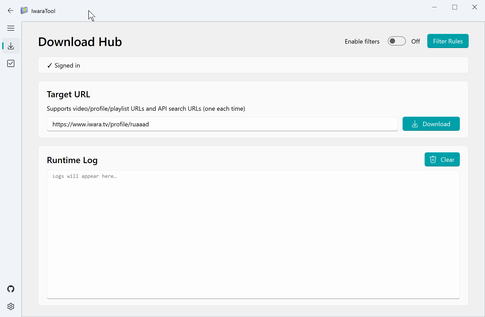

# IwaraTool


[简体中文](./readme_zh.md) | [日本語](./readme_ja.md)

Say goodbye to tedious command-line tools! Iwara batches downloader with a modern Fluent-style interface, making it easy for anyone to download all videos from a creator with one click.



## Features
- Valid `X-Version` signature calculation for API requests.
- Quality fallback: `Source -> 540 -> 360`.
- Stateful scheduler to avoid early URL expiration.
- Local dedup + SQLite history metadata.
- Batch enqueue from user profile, playlist, and search URLs.
- Filters: likes, views, date range, include tags, exclude tags.
- Search-only result cap.
- Token cache in `data/config.ini` for faster startup sign-in.
- Runtime language switching (`zh/en/ja`) without restarting.
- Filename template placeholders for flexible naming and directory layout.
- Optional aria2 RPC, thumbnail, and `.nfo` sidecar generation.

## Quick Start
1. Download latest binary from [Releases](https://github.com/Moeary/IwaraTool/releases).
2. Open app and sign in first.
3. Paste URLs in `New Download` and start queueing.

## Supported URL Types
```text
https://www.iwara.tv/profile/username
https://www.iwara.tv/profile/username/videos
https://www.iwara.tv/playlist/xxxxxxxx
https://www.iwara.tv/video/xxxxxxxx
https://www.iwara.tv/videos?sort=date
https://www.iwara.tv/videos?tags=2d&sort=likes
https://api.iwara.tv/videos?tags=2d&sort=date
```

`sort` supports: `date`, `trending`, `popularity`, `views`, `likes`.

`tags` supports see [Tag index](./docs/iwara_tags.md).

## Docs
- Wiki: <https://github.com/Moeary/IwaraTool/wiki>
- API notes (EN): [docs/API.md](./docs/API.md)
- Tag index: [docs/iwara_tags.md](./docs/iwara_tags.md)

## Run / Build

Project dependencies are managed by [pixi](https://pixi.prefix.dev/latest/).

If you are a developer and want to run the source code directly or build the app:

```shell
pixi run start // Run the application
pixi run build // Build the application
pixi run crawl // Crawl tag data (updates docs/iwara_tags.md)
```

## Contributing

Pull Requests are very welcome!
The app's i18n (multi-language) is currently not perfect, and the light/dark mode switch is not yet implemented. Although these do not affect the core download function, if you have time and are willing to help improve it, please submit a PR (please follow the standard submission update merge into the dev branch, and try to pass the GitHub Action CI/CD before submitting). Thanks!

## License

MIT License.

**By downloading this program, you agree to comply with the MIT License. See the LICENSE file for details.**

1. Using this project for any illegal, regulatory-violating purpose or any purpose against public order and good morals is prohibited; the user bears full responsibility for losses caused by non-compliant use.
2. The packaged versions and scripts provided by the project are for personal learning and research only, and may not be used for commercial redistribution or resale without permission.
3. Project maintainers reserve the right to update, suspend, or terminate services and support at any time in accordance with laws and regulations or community feedback.

## Special Thanks

Thanks to [hare1039](https://github.com/hare1039)'s [iwara-dl](https://github.com/hare1039/iwara-dl/tree/master) project for its valuable reference and inspiration, especially in the implementation details of X-Version signature calculation and download link parsing, which played a key role in the development of this project.
