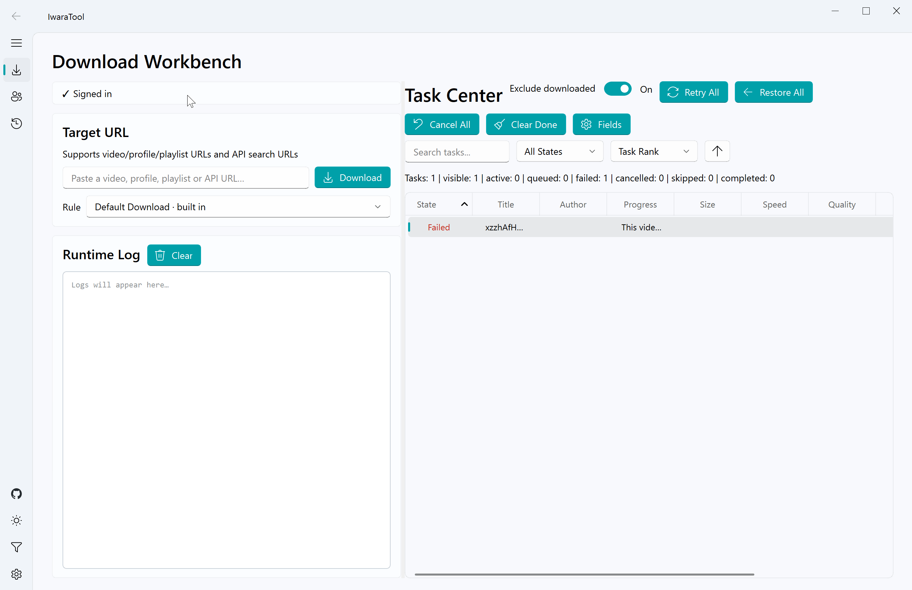
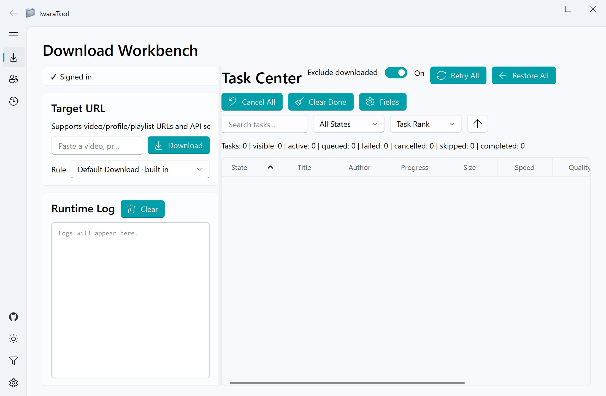
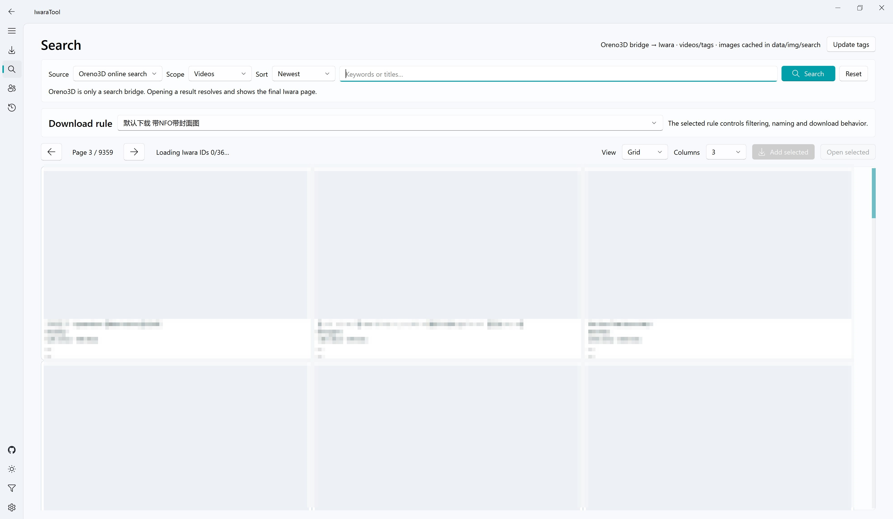
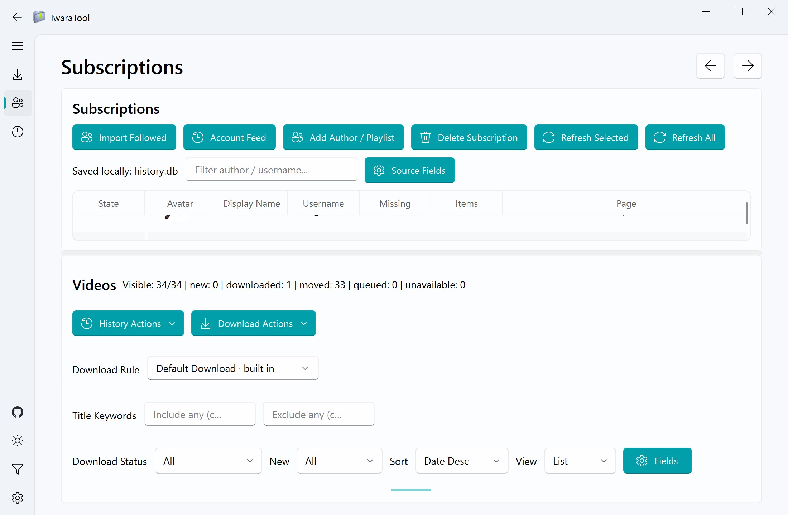
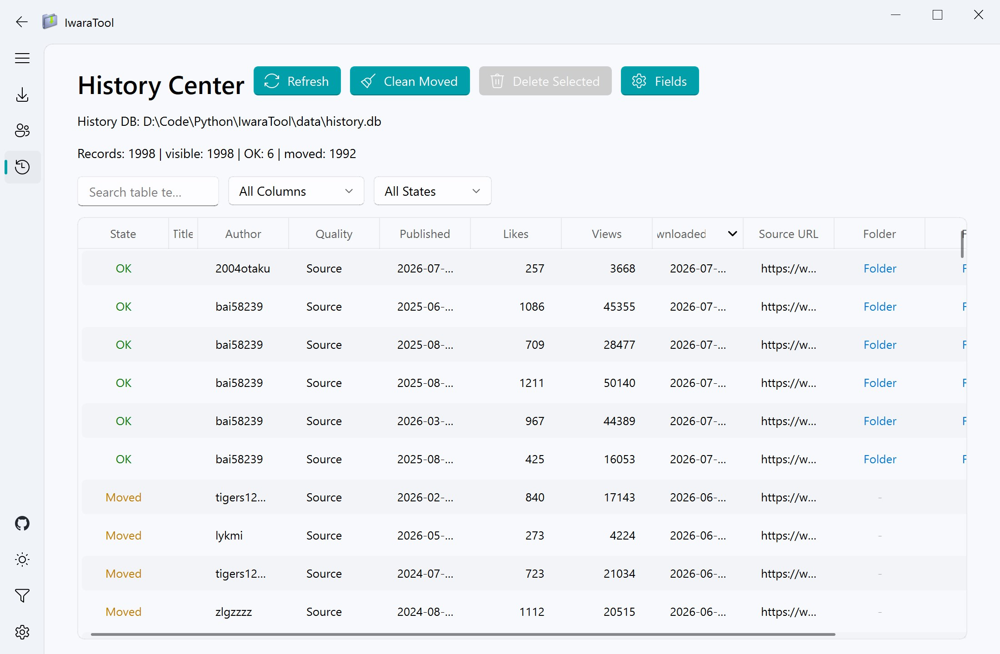
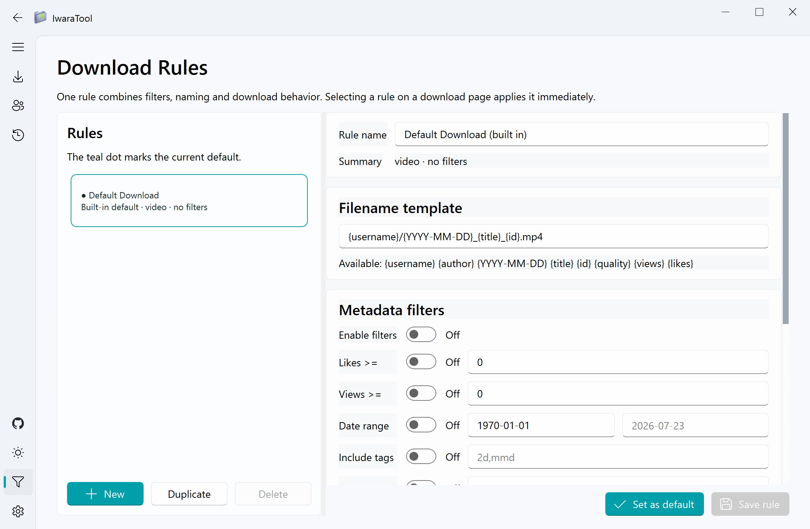
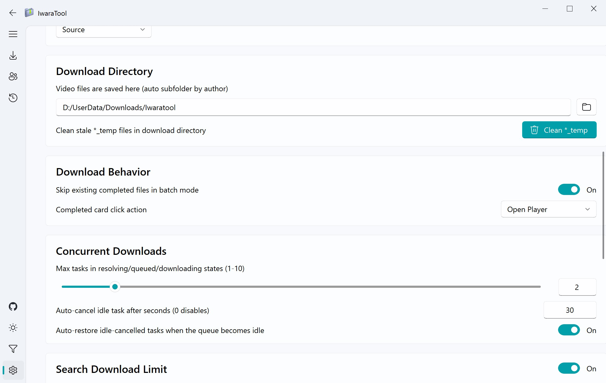

# IwaraTool


[English](./readme.md) | [简体中文](./readme_zh.md)

煩わしいコマンドラインにさよなら！モダンな Fluent スタイルのインターフェースを備えた Iwara 一括ダウンローダー。初心者でもワンクリックで作者の全動画をダウンロードできます。



## 主な機能
- `X-Version` 署名計算に対応。
- 画質フォールバック：`Source -> 540 -> 360`。
- ステートマシン制御で URL 失効問題を軽減。
- 安全終了時にタスクと一時ファイルを保持し、次回起動時に自動復元する永続キュー。
- ローカル重複回避 + SQLite 履歴センター。
- ユーザー、プレイリスト、検索 URL の一括投入に対応。
- より使いやすい Iwara 検索：Oreno3D オンライン動画検索、Iwara ライブ API の動画/作者/プレイリスト検索、英中日タグ候補に対応。
- フォロー作者の取込、更新確認、新着件数、リスト/カバー表示を備えたローカル購読管理。
- いいね、再生数、日付、タグ、タイトルキーワード、命名テンプレート、保存動作をまとめる名前付きルール。
- 検索ダウンロード件数上限を個別設定可能。
- `data/config.ini` に token を保存し起動ログインを高速化。
- 中/英/日のリアルタイム切替（再起動不要）。
- 実行中のライト/ダークテーマ切替。
- ファイル名テンプレートは複数プレースホルダーとディレクトリ制御に対応。
- aria2 RPC、サムネイル保存、`.nfo` 生成は任意で有効化可能。
- 履歴センターは検索、フィルター、ソート、ファイルを開く、名前変更、移動済み履歴の削除に対応。
- テーブル列、列幅、順序の設定と永続化、およびウィンドウサイズに応じた分割レイアウト。
- 再試行前に対応する一時キャッシュを削除し、壊れたキャッシュによる再失敗を軽減。

## クイックスタート
1. [Releases](https://github.com/Moeary/IwaraTool/releases) から最新版を取得。
   - Linux バイナリは GitHub の `ubuntu-latest` ランナーでビルドされるため、古い glibc の環境はサポート対象外です。古いディストリビューションではソースを取得してローカルでビルドしてください。
2. アプリを起動します。非公開動画の保存やフォロー作者の取込にはログインが必要です。
3. `ダウンロードワークベンチ` に URL を貼り付け、必要に応じてルールを選択して送信します。
4. `購読` でアカウントフィード、作者、プレイリストを追跡し、新着動画をまとめて保存できます。

## 対応 URL
```text
https://www.iwara.tv/profile/username
https://www.iwara.tv/profile/username/videos
https://www.iwara.tv/playlist/xxxxxxxx
https://www.iwara.tv/video/xxxxxxxx
https://www.iwara.tv/videos?sort=date
https://www.iwara.tv/videos?tags=2d&sort=likes
https://api.iwara.tv/videos?tags=2d&sort=date
```

`sort`：`date`、`trending`、`popularity`、`views`、`likes`。

`tags` の詳細は [タグ索引](./docs/iwara_tags.md) を参照してください。

Oreno3D のタグブリッジでは、タグスコープの単一ラベルを `/tags/{id}` へ直接検索できます。`tag:<id>`、`origin:<id>`、`character:<id>`、Oreno3D エンティティ URL にも対応し、結果は開く／キューへ追加する前に正式な Iwara 動画へ解決されます。

## ローカルデータとキャッシュ

実行時データは `data/` に保存され、用途ごとに分離されています。

| パス | 用途 |
| --- | --- |
| `data/config.ini` | Token、UI、並列数、ダウンロード動作の設定 |
| `data/tasks.json` | 復元可能な待機中、実行中、失敗、中断タスクの状態 |
| `data/history.db` | ダウンロード履歴とローカルファイル状態 |
| `data/subscriptions.db` | 購読元、購読動画、更新状態 |
| `data/rules.json` | 名前付きダウンロードルール |
| `data/iwara_tags.json` | 三言語フィールドを含む生成済みオフラインタグ索引 |
| `app/data/tag_translations/loveiwara_iwara_tags_localized.json` | アプリに同梱する LoveIwara MIT 翻訳ソース |
| `data/tag_translations/loveiwara_iwara_tags_localized.json` | 「タグを更新」で保存される実行時翻訳キャッシュ |
| `data/img/search/` | 検索ページ画像キャッシュ |
| `data/img/sub/` | 購読ページ動画カバーキャッシュ |
| `data/img/avatar/` | 購読作者アバターキャッシュ |

パッケージ版は `app/data/` の LoveIwara 辞書を同梱し、実行ファイル隣の `data/tag_translations/` に実行時キャッシュが無い場合、初回起動時に自動展開します。既存の実行時キャッシュは保持されます。開発環境の `data/` にあるその他のローカル状態は自動的に埋め込まれないため、更新時は既存の `data/` を残してください。

## 画面紹介

1. ダウンロードワークベンチ

   
2. 検索

   
3. 購読

   
4. 履歴

   
5. ルール

   
6. 設定

   

## ドキュメント
- Wiki: <https://github.com/Moeary/IwaraTool/wiki>
- API（JA）：[docs/API_ja.md](./docs/API_ja.md)
- タグ索引：[docs/iwara_tags.md](./docs/iwara_tags.md)

## 実行 / ビルド

プロジェクトの依存関係は [pixi](https://pixi.prefix.dev/latest/) で管理されています。

開発者としてソースコードを直接実行したい、またはアプリをビルドしたい場合：

```shell
pixi install
pixi run start  # プログラムを実行
pixi run build  # アプリをビルド
pixi run crawl  # タグデータを取得（docs/iwara_tags.md を更新）
pixi run python -m unittest discover -s tests -p "test_*.py" -v
```

## 貢献

PRは大歓迎です！
変更は `dev` ブランチ向けに提出し、英語、簡体字中国語、日本語の UI 文言を同期してください。提出前にテスト一式を実行し、UI の変更には可能であればスクリーンショットまたは短い録画を添付してください。

## ライセンス

MIT License。

**本プログラムをダウンロードした時点で、MIT ライセンスを遵守することに同意したものとみなされます。詳細は LICENSE ファイルを参照してください。**

1. 本プロジェクトを違法、公序良俗に反する目的、または法令に違反する目的で使用することを禁止します。違反した使用により生じた損害については、ユーザーが全責任を負うものとします。
2. 本プロジェクトで提供されるパッケージ版およびスクリプトは、個人の学習および研究目的のみに使用されるものであり、許可なく商用での再配布や転売を行うことはできません。
3. プロジェクトの管理者は、法令またはコミュニティのフィードバックに基づき、いつでもサービスおよびサポートを更新、中断、または終了する権利を留保します。

## 特別感謝

[hare1039](https://github.com/hare1039) 氏の [iwara-dl](https://github.com/hare1039/iwara-dl/tree/master) プロジェクトから貴重な参考とインスピレーションをいただきました。特に X-Version 署名計算とダウンロードリンク解析の実装詳細は、本プロジェクトの開発に大きな推進力となりました。
