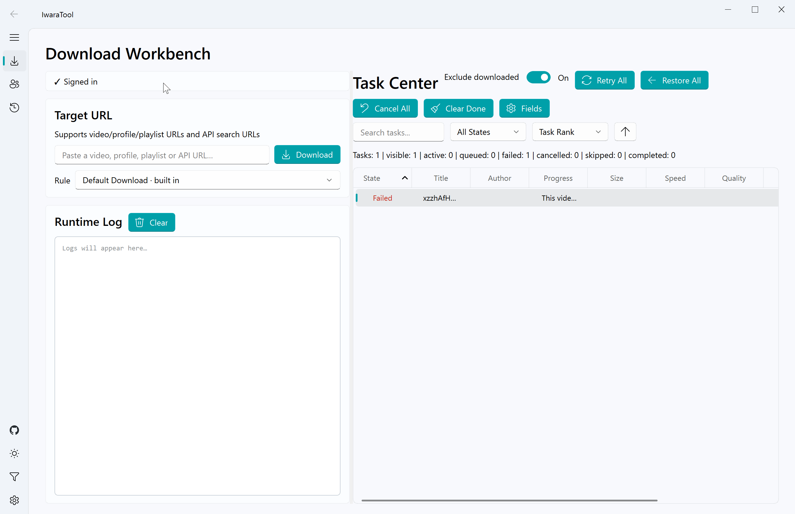
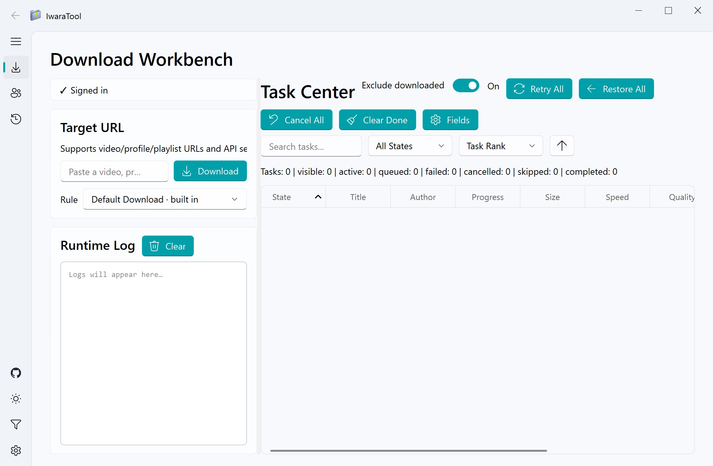
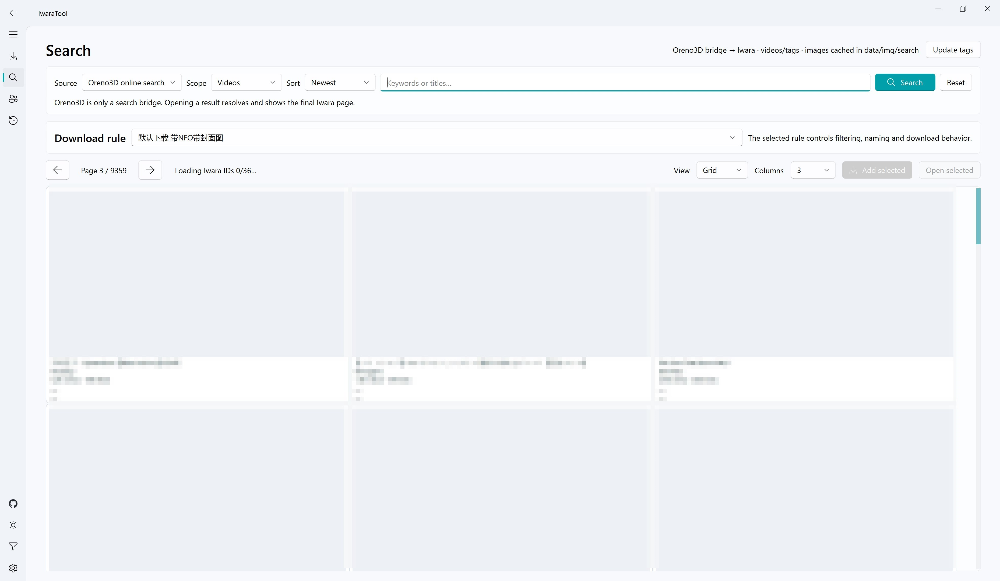
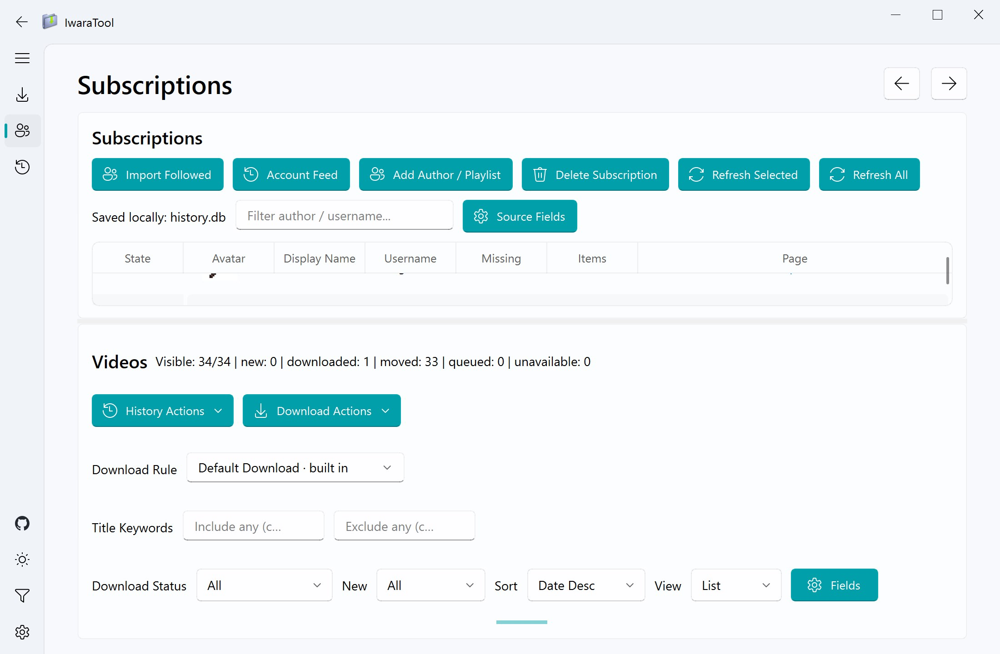
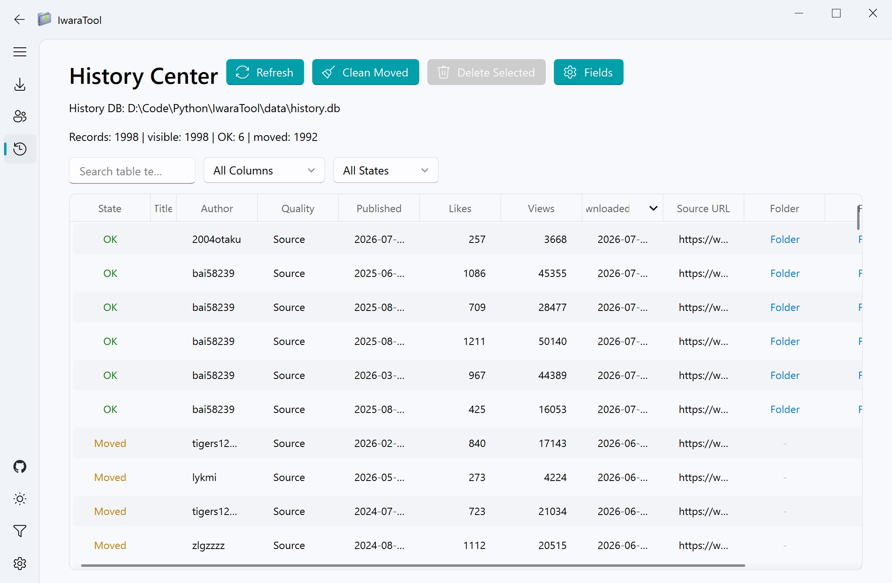
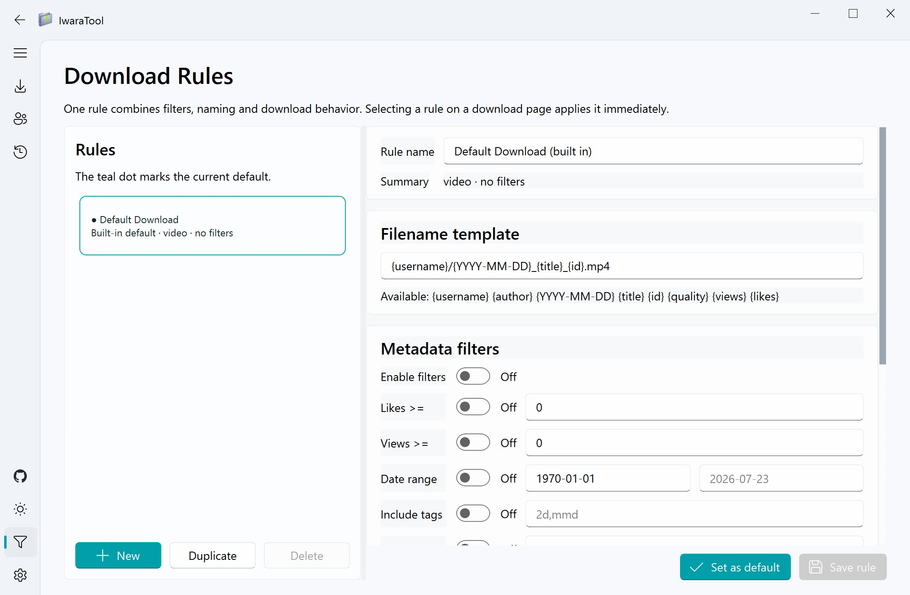
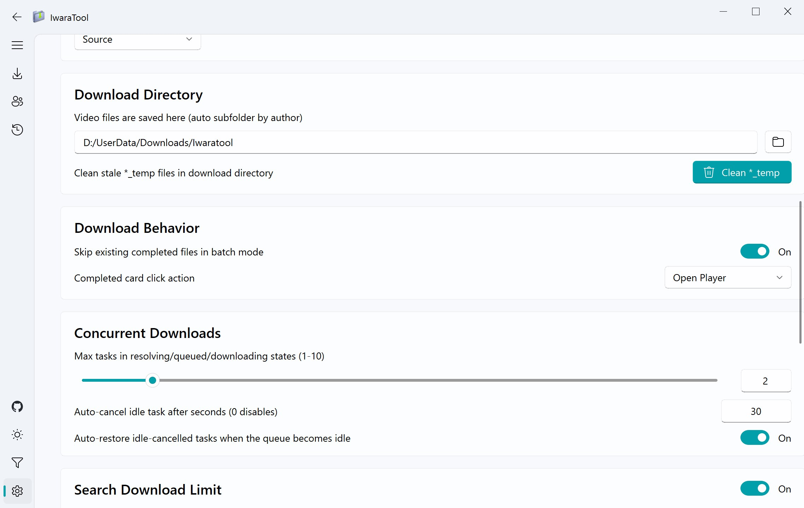

# IwaraTool


[English](./readme.md) | [简体中文](./readme_zh.md)

煩わしいコマンドラインにさよなら！モダンな Fluent スタイルのインターフェースを備えた Iwara 一括ダウンローダー。初心者でもワンクリックで作者の全動画をダウンロードできます。



ドキュメント: [Wiki](https://github.com/Moeary/IwaraTool/wiki) · [API（JA）](./docs/API_ja.md) · [タグ索引](./docs/iwara_tags.md)

## 主な機能
- ユーザー、プレイリスト、検索 URL の一括投入に対応。タスクキューは永続化され、安全終了後に自動復元されます。
- ダウンロードエンジン：`X-Version` 署名計算、画質フォールバック（`Source -> 540 -> 360`）、ステートマシン制御による URL 失効の軽減。
- ローカル重複回避と、検索・フィルター・ソート・整理に対応した SQLite 履歴センター。
- 検索：Iwara ライブ API の動画／作者／プレイリスト検索、Oreno3D オンライン動画検索、英中日タグ候補に対応。結果にはローカル保存状態を表示します。
- 動画プレビュー：どのページでも動画をダブルクリックで再生。保存済みは選択したプレイヤー（システム既定／内蔵／カスタムコマンド）で開き、未保存・移動済みは内蔵ウィンドウでストリーミング再生します（再生/一時停止、シーク、倍速、音量、全画面、長押し倍速に対応）。
- 購読管理：作者とプレイリストの購読。既定の概要ではアイコンと最新動画を一覧し、開くとカードグリッドで表示、従来の表形式にも切り替え可能。
- 名前付きルール：いいね、再生数、日付、タグ、タイトルキーワード、命名テンプレート、保存動作を管理。NFO 生成に対応。
- ホーム：iwara.tv のように購読・人気動画・人気画像を表示し、アプリ内で詳細を確認、まとめてダウンロード。SFW／NSFW の区分はホームと検索に適用されます。
- 修復センター：既存動画を元の場所で一括リネーム、または出力先へ整理。保存先の競合を検査します。
- 中／英／日の言語切替とライト／ダークテーマを実行中に切替可能。テーブル列の設定は保存されます。
- 任意機能：aria2 RPC、サムネイル、`.nfo` の生成。
- 信頼性：ダウンロードのサイズ・レジューム検証、API リクエストのバックオフ再試行と間隔制御、SQLite WAL、ローテーションログ（`data/logs/`）。
- 保守：システムトレイと自動起動、認証情報を含まないバックアップ／復元、SHA-256 検証付きワンクリック更新（Windows パッケージ版）。

## クイックスタート
1. [Releases](https://github.com/Moeary/IwaraTool/releases) から最新版を取得。
   - Linux バイナリは GitHub の `ubuntu-latest` ランナーでビルドされるため、古い glibc の環境はサポート対象外です。古いディストリビューションではソースを取得してローカルでビルドしてください。
2. アプリを起動します。非公開動画の保存やフォロー作者の取込にはログインが必要です。
3. `ダウンロードワークベンチ` に URL を貼り付け、必要に応じてルールを選択して送信します。
4. `購読` で作者とプレイリストを追跡し（アカウントフィードはホームの「購読中の更新」）、新着動画をまとめて保存できます。

詳細（修復センター、検索の保存状態、Oreno3D 作者のフォールバック、キーワード／タグ検索、購読カバーのキャッシュ）は [使用ガイド](./docs/guide/usage_ja.md) を、ローカルデータとキャッシュは [ローカルデータとキャッシュ](./docs/guide/data_ja.md) を参照してください。

## 対応 URL
```text
https://www.iwara.tv/profile/username
https://www.iwara.tv/profile/username/videos
https://www.iwara.tv/playlist/xxxxxxxx
https://www.iwara.tv/video/xxxxxxxx
https://www.iwara.tv/videos?sort=date
https://www.iwara.tv/videos?tags=2d&sort=likes
https://api.iwara.tv/videos?tags=2d&sort=date
```

`sort`：`date`、`trending`、`popularity`、`views`、`likes`。

`tags` の詳細は [タグ索引](./docs/iwara_tags.md) を参照してください。

## 画面紹介

1. ダウンロードワークベンチ

   
2. 検索

   
3. 購読

   
4. 履歴

   
5. ルール

   
6. 設定

   

## 実行 / ビルド

プロジェクトの依存関係は [pixi](https://pixi.prefix.dev/latest/) で管理されています。

開発者としてソースコードを直接実行したい、またはアプリをビルドしたい場合：

```shell
pixi install
pixi run start  # プログラムを実行
pixi run build  # アプリをビルド
pixi run crawl  # タグデータを取得（docs/iwara_tags.md を更新）
pixi run test   # テストを実行
```

## 貢献

PRは大歓迎です！
変更は `dev` ブランチ向けに提出し、英語、簡体字中国語、日本語の UI 文言を同期してください。提出前にテスト一式を実行し、UI の変更には可能であればスクリーンショットまたは短い録画を添付してください。

## ライセンス

MIT License。

**本プログラムをダウンロードした時点で、MIT ライセンスを遵守することに同意したものとみなされます。詳細は LICENSE ファイルを参照してください。**

1. 本プロジェクトを違法、公序良俗に反する目的、または法令に違反する目的で使用することを禁止します。違反した使用により生じた損害については、ユーザーが全責任を負うものとします。
2. 本プロジェクトで提供されるパッケージ版およびスクリプトは、個人の学習および研究目的のみに使用されるものであり、許可なく商用での再配布や転売を行うことはできません。
3. プロジェクトの管理者は、法令またはコミュニティのフィードバックに基づき、いつでもサービスおよびサポートを更新、中断、または終了する権利を留保します。

## 特別感謝

[hare1039](https://github.com/hare1039) 氏の [iwara-dl](https://github.com/hare1039/iwara-dl/tree/master) プロジェクトから貴重な参考とインスピレーションをいただきました。特に X-Version 署名計算とダウンロードリンク解析の実装詳細は、本プロジェクトの開発に大きな推進力となりました。
